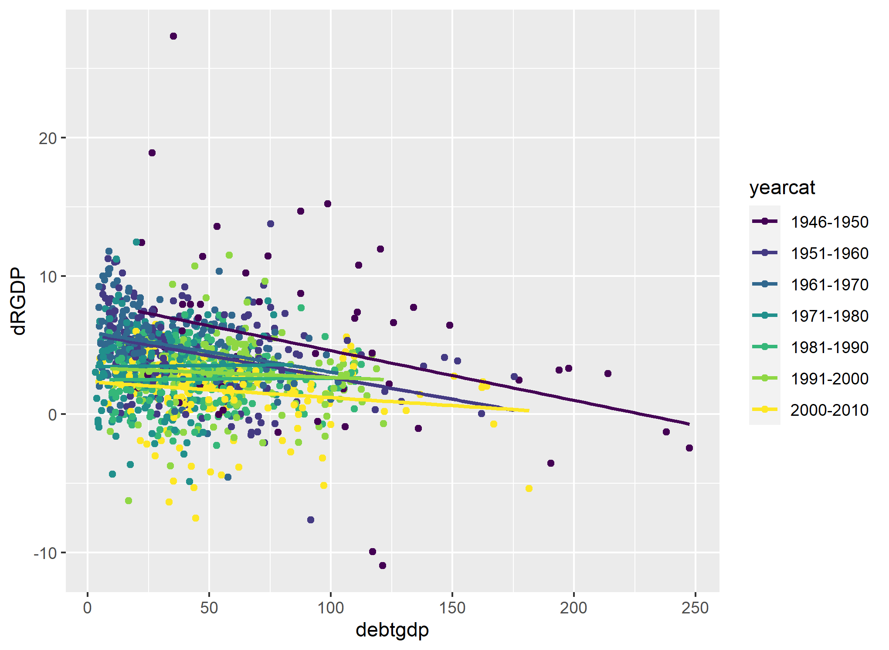

```{r setup, include=FALSE}
knitr::opts_chunk$set(echo = TRUE)
```

My script PS1_JL.R generates the following objects that I present in this report.

``` {r}

load("Table_10_Replication.Rdata")
load("Table_11_Replication.Rdata")

load("Table_10_A1.Rdata")
load("Table_11_A1.Rdata")

load("Table_10_A2.Rdata")
load("Table_11_A2.Rdata")

load("prev_1.Rdata")
load("prev_2.Rdata")
load("prevGDP.Rdata")

load("A1.Rdata")
load("A1_A1.Rdata")
load("A2_A1.Rdata")
load("prev_A.Rdata")
```

# Problem 1
## Part A


In this part I replicate in R tables 10, 11 and A1 from Pollin and Chakraborty. I take the employment data and original weights from the file "India-Input-Output Analysis--Employment Estimates--09132019.xlsx". Input-Output comes from the file "IND_NIOT_row_09132019.xlsx" that I took from the official WIOD page


Below is a replication of Table A1 which summarizes the weighting system used in the original paper. 

```{r, layout="l-body-outset"}
library(knitr)
kable(A1)
```

Each of the 35 I-O industries belongs to at last a sub-sectoral energy category (10 in total) and each of those can be classified in 3 broad energy categories: renewable, efficiency and fossil fuels. 

By getting the "Leontieff" inverse matrix we can also get the direct labor that goes into the production of one unit of each "good". The following table is a replication of Table 10 of the paper that shows how many jobs would each energy sub-sebctor generate given a million USD increase in the final demand of the industries that form them.  


Replication of Table 10

```{r, layout="l-body-outset"}
library(knitr)
kable(T10)
```

Table 11 below is a summary of table 10 as it only includes the weighted averages of each sub-sector classified in the broader sectors of renewable energy, energy efficiency and fossil fuels. The sum of the first two gives the row "Clean Energy Total". Whereas the las row is obtained by the formula $\frac{Clean EnergyTotal-FossilFuels}{FossilFuels}*100\%$ Note: the value of this row is different than in the paper because there they used the weights 67% and 33% to renewables and efficiency respectively, whereas here I kept the 50-50% of the original table. I keep those final weights for the rest of the analysis


Replication of Table 11

```{r, layout="l-body-outset"}
library(knitr)
kable(T11_4)
```

The most salient fact is that an investment of 1 USD for both fossil fuels and clean energy would result in more than twice (102.82%) more jobs generated in the latter than in the former. 
 
## Part B

In this part I conduct the same analysis but changing the weights at the I-O industry level. I show these new weights in my table below

```{r, layout="l-body-outset"}
library(knitr)
kable(A1_A1)
```

Although not making the analysis very formal, in these new weihgts I tried to punish a little those industries that intuitively are more labor-intensive, such as education or construction, and increasing the weight of capital intensive industries such as mining and construction.

The new results are shown in the below.

Replication of Table 10 with alternative weights at the sub-sectoral level: 

```{r, layout="l-body-outset"}
library(knitr)
kable(A1_T10)
```

Replication of Table 11 with alternative weights at the sub-sectoral level 

```{r, layout="l-body-outset"}
library(knitr)
kable(head(A1_T11_4))
```

Maybe not very surprisingly, the new weights didn't alter the basic result: that clean energies would generate more than twice the jobs of fossil fuels (111.02% in this case). I think a large part of this result comes from the fact that I left unchanged the weight of agriculture (that belongs to the wub-bioenergy sector), which is by far the "industry" that generates more jobs in India. 

Now I keep the original weights of each industry but change the wieghts of each subsector. This summarized in the table below
Table A1

```{r, layout="l-body-outset"}
library(knitr)
kable(A2_A1)
```

The new results are found in the next two tables. Obviously, the amount of indirect and direct jobs generated by each energy subsector are the same as in the original paper, since the weights of industries remained unchanged. The changes come in the weighted averages of each broad sector. But that is better summarized in table 11

Table 10 

```{r, layout="l-body-outset"}
library(knitr)
kable(A2_T10)
```

Table 11

```{r, layout="l-body-outset"}
library(knitr)
kable(A2_T11_4)
```

There we can see that, although with some composition effects, the basic result of the original paper remains, since with this alternative system clean energies generate 116.33% more jobs than fossil fuel energies. 

# Poblem 2

## 1 Replication of figure 2 RR

Below I present a replication of figure 2 in RR paper

```{r pressure, echo=FALSE, fig.cap="Figure 2 RR", out.width = '75%'}
knitr::include_graphics("F2.png")
```

There are two main facts: average and median gdp growth is the highest in the lowest debt/GDP category. But the most important is that once the ratio is above 90%, economic growth is "not viable". We know that this is largely due to the mistakes of the authors. (Note: in the original figure the first two bars are slightly below 4 and here are above. This was replicated using the code provided by the professor.)

## 2. Show the prevalence of the four public-debt categories for the sample of countries over time.Show the real GDP growth rate for the sample of countries over time. Discuss any patterns thatyou observe. 

First by country and total:

```{r, layout="l-body-outset"}
library(knitr)
kable(prev_1)
```

```{r, layout="l-body-outset"}
library(knitr)
kable(prev_2)
```

We observe that most countries lied in the first two categories of debt/GDP during the analyzed period. Only a few countries had many episodes of very high debt/GDP, such as Greece, the UK and Japan. 

We know observe the prevalence of debt/GDP over time. We observe that the 60s and 70s were periods of low debt/GDP, whereas most episodes of very high debt/GDP are found in the last 20 years as well as in the immediate post-war period.

```{r, layout="l-body-outset"}
library(knitr)
kable(prev_A)
```

Finally, let's observe the prevalence of Real GDP Growth for our sample of countries


```{r, layout="l-body-outset"}
library(knitr)
kable(prevGDP)
```

It is clear that economic growth is highest in the first 3 columns, whereas in the last three GDP growth is mediocre, with just a very few countries growing more than 3%.  

## 3. Replication of figures 1, 2 and 4 of Herndon et al. 


```{r, echo=FALSE, fig.cap="Figure 1 Herndon et al.", out.width = '75%'}
knitr::include_graphics("Figure_1_Herndon.png")
```

Figure 1 of Herndon et al. shows the very weak relationship between debt/GDP and real GDP growth once the mistakes are corrected. The line connecting the averages would be almost horizontal 


```{r, echo=FALSE, fig.cap="Figure 2 Herndon et al.", out.width = '75%'}
knitr::include_graphics("Figure_2_Herndon.png")
```

Figure 2 expands the debt categories by including "above 120%". This figure shows how the average GDP growth in eposides of debt/GDP above 120% is very low, so that could be driving the very negative effect of high debt on GDP growth


```{r, echo=FALSE, fig.cap="Figure 4 Herndon et al.", out.width = '75%'}
knitr::include_graphics("Figure_4_Herndon.png")
```

Figure 4 shows the relationship between these two variables and better illustrates the finding of last figure, as after 90% of the GDP ratio the relationship between the two variables becomes very negative, but that is not the case in the previous categories. 

\bigskip


## Reorganization in a meaningful way

In this part I focus on different year categories. I create a dummy variable that takes value 1 if year is greater than 1979 and 0 otherwise. Then I plot the relationship between debt/GDP and real GDP growth and add two linear regressions.

```{r, echo=FALSE, fig.cap="Before and After 1979", out.width = '75%'}
knitr::include_graphics("gn.png")
```

Just as we expected, the relationship is more negative for the blue points (after 1979), since those were the years of the highest debt/GDP (just after the immediate postwar).

```{r, echo=FALSE, fig.cap="Before and After 1979", out.width = '75%'}

```

