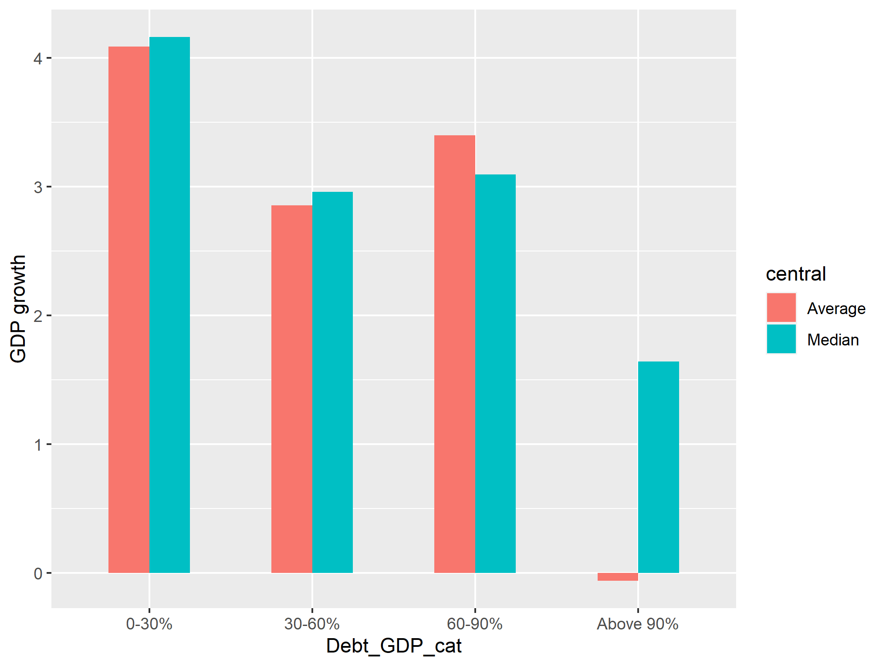
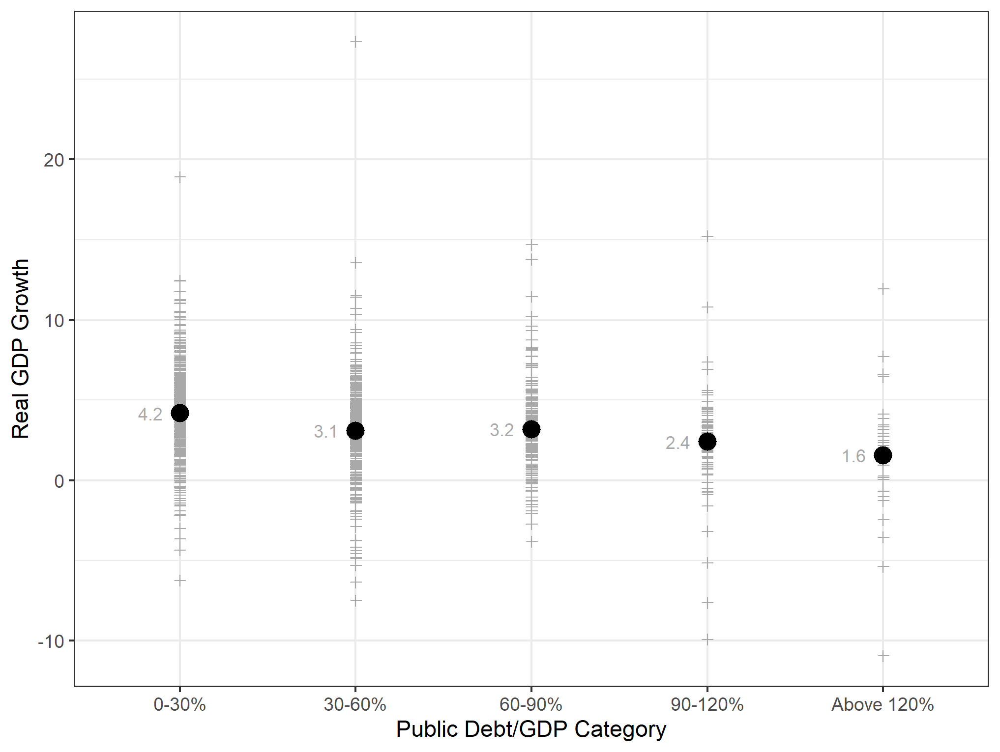
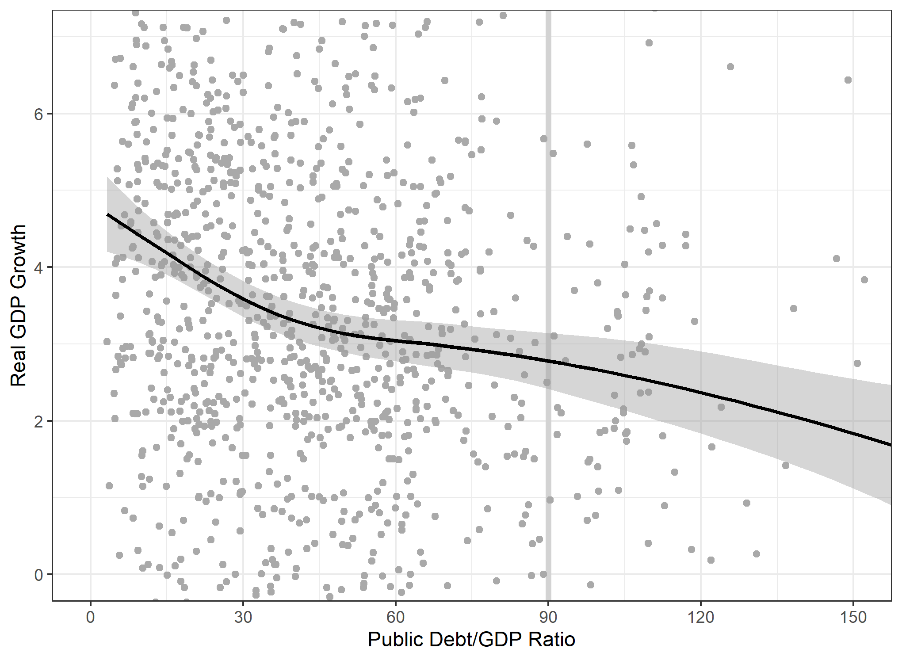
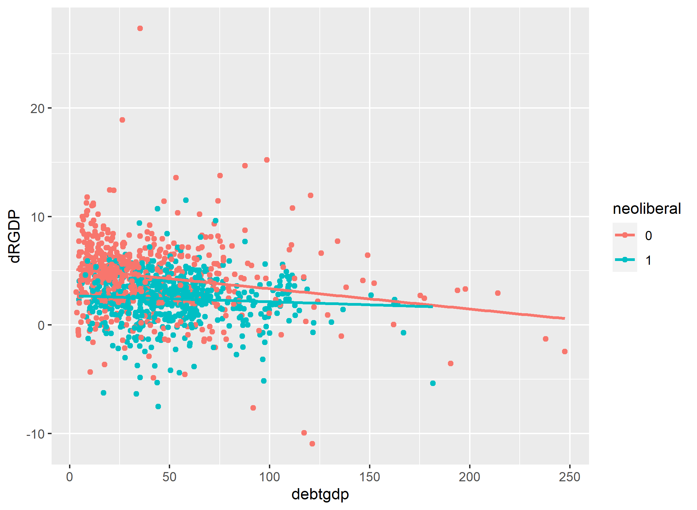

```{r setup, include=FALSE}
knitr::opts_chunk$set(echo = TRUE)
```

# Problem 1
## Part A

``` {r, echo=FALSE}

load("Table_10_Replication.Rdata")
load("Table_11_Replication.Rdata")

load("Table_10_A1.Rdata")
load("Table_11_A1.Rdata")

load("Table_10_A2.Rdata")
load("Table_11_A2.Rdata")

load("prev_1.Rdata")
load("prev_2.Rdata")
```

Replication of Table 10

```{r, layout="l-body-outset"}
library(knitr)
kable(head(T10))
```

Replication of Table 11

```{r, layout="l-body-outset"}
library(knitr)
kable(head(T11_4))
```

## Part B

Replication of Table 10 with alternative weights at the subsectoral level 

```{r, layout="l-body-outset"}
library(knitr)
kable(head(A1_T10))
```

Replication of Table 10 with alternative weights at the subsectoral level 

```{r, layout="l-body-outset"}
library(knitr)
kable(head(A1_T11_4))
```


Now with different weights at the sectoral level


```{r, layout="l-body-outset"}
library(knitr)
kable(head(A2_T11_4))
```


# Poblem 2

## 1 Replication of figure 2 RR

```{r pressure, echo=FALSE, fig.cap="Figure 2 RR", out.width = '75%'}

```

## 2. Show the prevalence of the four public-debt categories for the sample of countries over time.Show the real GDP growth rate for the sample of countries over time. Discuss any patterns thatyou observe. 

```{r, layout="l-body-outset"}
library(knitr)
kable(prev_1)
```

```{r, layout="l-body-outset"}
library(knitr)
kable(prev_2)
```

## 3. Replication of figures 1, 2 and 4 of Herndon et al. 

Figure 1 Herndon
```{r, echo=FALSE, fig.cap="Figure 1 Herndon et al.", out.width = '75%'}
knitr::include_graphics("Figure_1_Herndon.png")
```

Figure 2 Herndon

```{r, echo=FALSE, fig.cap="Figure 2 Herndon et al.", out.width = '75%'}

```

Figure 4 Herndon

```{r, echo=FALSE, fig.cap="Figure 4 Herndon et al.", out.width = '75%'}

```

### Reorganization in a meaningful way

```{r, echo=FALSE, fig.cap="Before and After 1979", out.width = '75%'}

```

