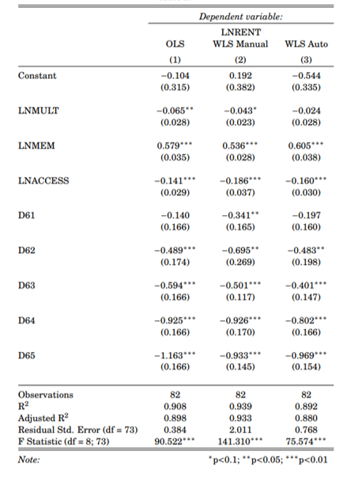
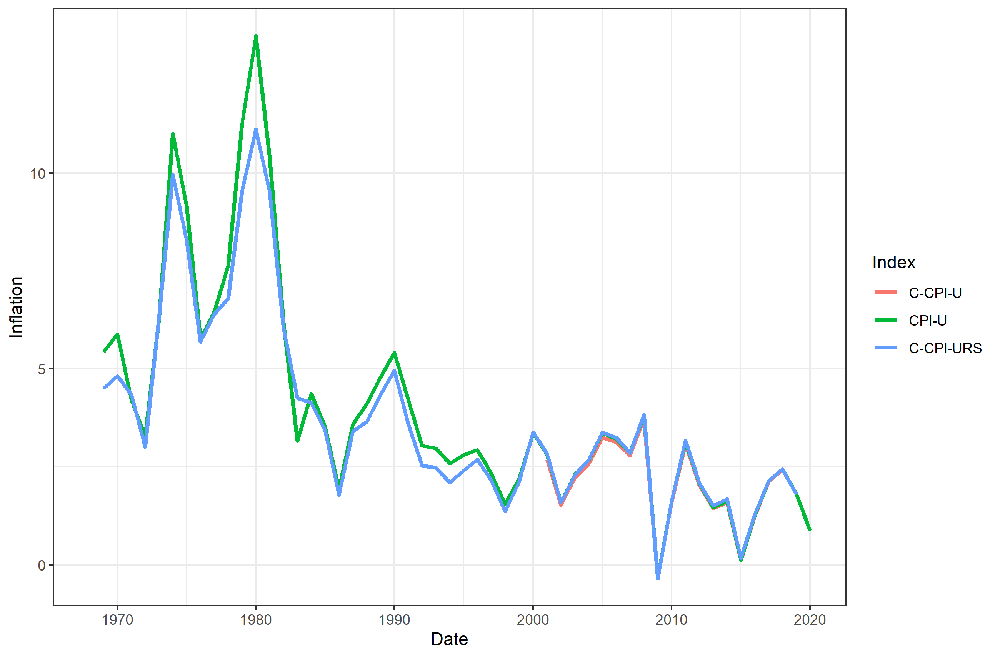
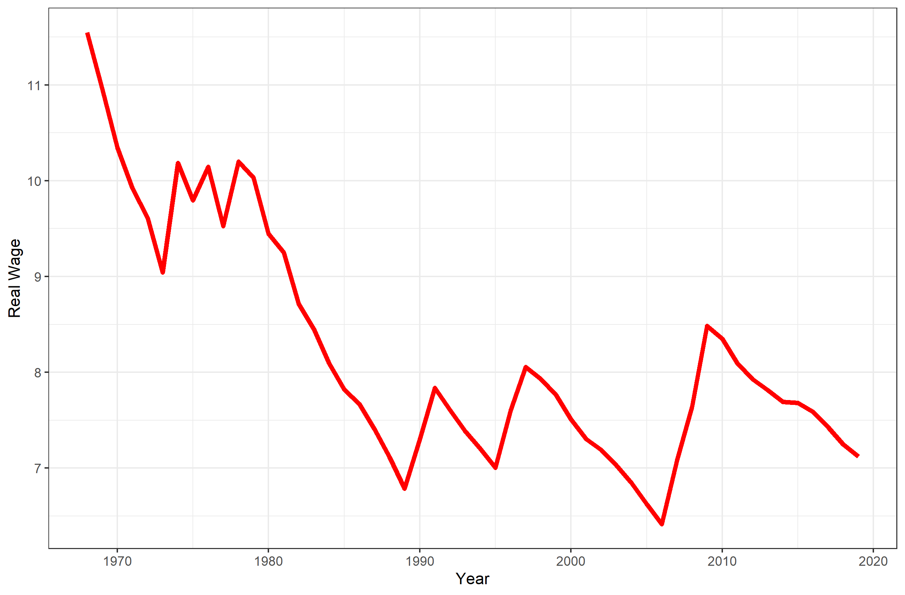
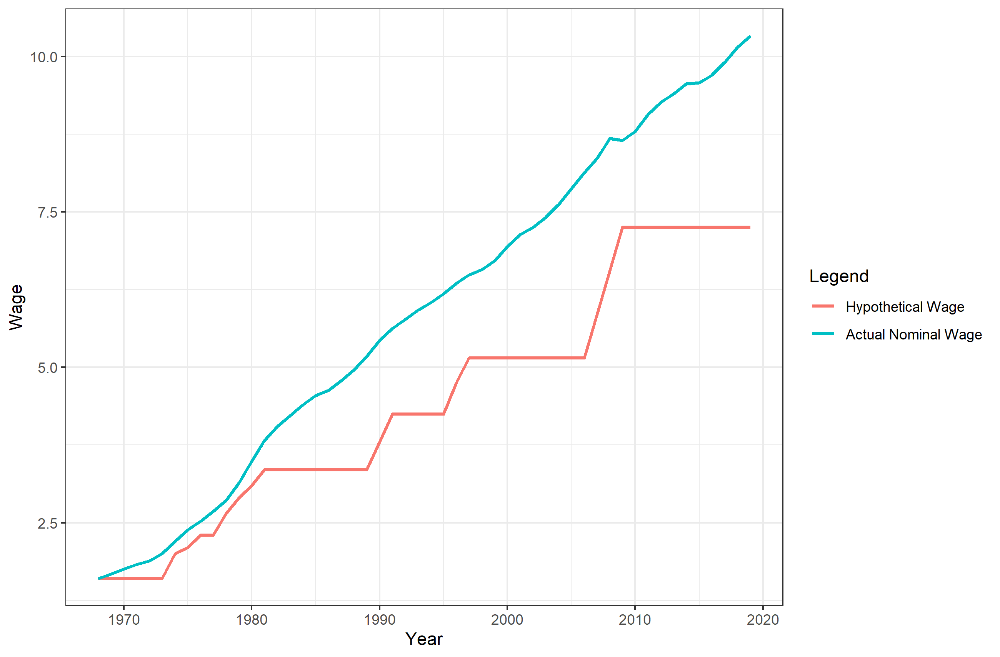

```{r setup, include=FALSE}
knitr::opts_chunk$set(echo = FALSE)
```

``` {r}
load("cor59.Rdata")
load("cor65.Rdata")
load("lmb.Rdata")
load("reg_index.Rdata")
load("st_problem3.tex")
load("reg_index2.Rdata")
load("reg_index3.Rdata")
```

# Part 1

# Question 3a 

In this part I replicate Chow’s estimation of the hedonic price model, in which he studies the effect of different qualitative characteristics on the price of computers 

In the first part we are asked to get the correlation matrices of the dependent and independent variables for two periods of time: 1954-1959 and 1960-1965. The results are shown below

```{r, layout="l-body-outset"}
library(knitr)
kable(cor_chow_59, caption="Correlation Matrix for 1954-1959")
kable(cor_chow_65, caption="Correlation Matrix for 1960-1965")
```
All the variables are highly correlated. The fact that the price (LNRENT) is correlated with the independent variables is not an issue, but Chow’s concerns regarding collinearity seem to be justified as, for the period 1954-1959, these correlations are never (in absolute value) below .73. In the second period, however, some correlations decrease substantially, for example that between access and multiplication time. The main decrease happens in the correlation between memory size and the rest of independent variables. I understand this as an increase in the variety of computers with different features. In the first period, in contrast, it seems to me that there was a very sharp distinction between “good” and “bad” computers, the former having all the good features and the latter all the bad ones. Given this, the separation of the regression in two periods is a good idea.


```{r, layout="l-body-outset"}
library(knitr)
kable(cor_chow_59)
```

# Question 3b
```{r, layout="l-body-outset"}
library(pander)
library(knitr)
library(broom)
panderOptions("table.caption.prefix","Quality-Controlled Regression of lnrent on Quality-Variables")
##pander(summary(chow.lm65), caption="Quality-Controlled Regression of lnrent on Quality-Variables")
##pander(summary(chow.lm65))
kable(tidy(lmb), caption="Quality-Controlled Regression of lnrent on Quality-Variables")
```
The results of the regression are the same as those obtained by Chow. The signs are as expected: “good” features (memory) are associated with a higher rental price and bad ones (multipication and access time) with a lower price.

Then we set the price index for 1960 equal to one and take antilogs. That is how we get or price indices for the different years, which are the same as those obtained by Chow. The estimated coefficients fall as year increases, but once we take antilogs, we get a more intuitive interpretation: controlling for changes in quality, the price index is continually falling from one year to the other such that, by 1965, the price of a computer is, on average, less than a third of its price in 1960.

```{r, layout="l-body-outset"}
library(knitr)
kable(reg_index, caption="Replicated Price Indices")
```

# Question 3e
The concern is that the variance of computer models with a high volume of sales is lower than the variance of models with a low volume of sales sales. That is, we can assume that $\sigma^2_i=\frac{\sigma^2}{Volume_i}$, so, if we want to correct for heteroscedasticity, we have to multiply all variables by $sqrt(Volume)$, so that, when calculating the variance, volume cancels out and we have the same variance $\sigma^2$. From this we can see that if instead of volume we have ln(volume), large values will be compressed so the divergence between the $\sigma_i$'s will be less if and only if volume has “large” values. In contrast, if volume was between 0 and 1, the log would make the heteroscedasticity problem worse. However, we are in the first case so we would expect to be a small different between the two methods of estimating the variance. I did this manually and then using the WLS command of R, the results are shown in the table below. The manual and auto methods don’t give exactly the same results. But in the three regressions, the signs are unchanged and the only change in significance occurs with LNMULT, that is significant at the 1% level with OLS but not with WLS.

```{r,  fig.cap="OLS and WLS for price indices", out.width = '75%',fig.align = 'center'}

```


# Question 6a

Now we are going the analyze the whole period 1954-1965. We use two different methods: a pooled model with dummy variables for years, and the estimation of 11 models with a dummy for year (there are 2 adjacent years in each model).
```{r, layout="l-body-outset"}
library(knitr)
kable(reg_index2, caption="Pooled vs Adjacent Year")
```

The results of the pooled model are in the first column and those of the 11 models in the third one. The results are substantially different. A better comparison takes the difference of the pooled model coefficients from one year to the other. When doing that, the results are very similar for most years.

# Question 6b
We use the results from the last question to build two alternative Price Indices. For the first one (Pooled CPI), we simply take antilogs to the coefficients of the pooled moodel. For the second one, we cumulatively sum the coefficients of the adjacent-years models and take antilogs.


```{r, layout="l-body-outset"}
library(knitr)
kable(reg_index3, caption="Two alternative price indices")
```

The results are very similar, although the price index is always lower in the chained model. The greatest advantage of the latter is that we are allowing the qualitative characteristics of the computers to vary, whereas in the pooled model we are just taking an average of them. 

# Part 2

## Inflation

We calculate inflation from 1968 using 3 different Price Indices: CPI-U, C-CPI-U and CPI-U-RS. All obtained from the BLS. The C-CPI-U is available from December 1999. The C-CPI-URS is available from 1979 and I completed it with the CPI-U-X1 obtained from the 2012 report of the president. I take 2018 as the base year for all the analysis. 

Plot 1: Inflation
```{r,  fig.cap="Inflation with 3 different indices", out.width = '75%',fig.align = 'center'}

```
The plot shows how, from 2000, the three indices give basically the same level of inflation, although it is slighty lower for the C-CPI-U, as it is taking into account changes in quality. It is no surpirse that CPI-U and CPI-U-RS are the same in these years since they started to be calculated with the same method. For the years before 2000, the CPI-U is  generally greater than the CPI-U-RS, although the difference is greater in times of high inflation.

## Minimum wage in 2018 dollars.
```{r,  fig.cap="Minimum wage in 2018 dollars", out.width = '75%',fig.align = 'center'}

```

In this part, I divide the statutory nominal wage by the CPI-U price index taking 2018 as the base year. This shows how the real minimum wage has, overall fallen from its initial level in 1969, from above 10 to slightly more then 7 2018 dollars per hour. The spikes are simply the increases in nominal minimum wage, but it is very interesting that almost immediately after these nominal increases, the real wage falls again. 

Plot 2: Minimum wage in 2018 CPI-U dollars


## Cost of living adjustment and inflation
```{r,  fig.cap="Statutory vs hypothetical COLA with CPI inflation", out.width = '75%',fig.align = 'center'}

```
We now calculate what would have happened if the minimum wage adjusted according to changes in the CPI-U index. We do this by calculating the cumulative increase in the minimum wage by multiplying it by that year's inflation measured with the CPI-U. We can see that, until 1980, the two move together (although the hypothetical minimum wage is always higher). However, from 1980, the nominal minimum wage stagnates and the gap between the two starts to increase. The gap is just reduced in 2006, but the trend since then is for the gap to increase. These two very simple graphs show how real minimum wage has in fact declined over the last 40 years.

Plot 3: Statutory vs hypothetical COLA with CPI inflation 


# Part 3 Replication

I will replicate the following paper:

Conconi, P., García-Santana, M., Puccio, L., & Venturini, R. (2018). From final goods to inputs: The protectionist effect of rules of origin. American Economic Review, 108(8), 2335–2365. https://doi.org/10.1257/aer.20161151

My plan is to replicate the whole paper, although I may not have time to replicate some of the robustness checks because they need a transformation of the Mex-USA input-output table that seems to take considerable time. 


# R Code
```{r eval=FALSE, echo=T}
library(dplyr)
library(tidyr)
library(data.table)
library(ggplot2)
library("rio")
library(matlib)
library(gdata)
library(tinytex)
library(scales)
library(ggplot2)
library(foreign)
library(rmarkdown)
library(fastDummies)
library(stargazer)
library(naniar)


options(scipen=10000)
options(digits=4)

rm(list=ls())

################### PROBLEM 1 ##########################################
########################################################################

#Set my working directory
setwd("C:/Users/User/Documents/GitHub/Problem-Sets--753/PS2")

chow <- fread('https://courses.umass.edu/econ753/berndt/chap4.dat/chow')

#(a) Construct appropiate variables and get correlation matrices

chow<-chow %>%   mutate(across(where(is.integer), as.numeric))%>%
  mutate(across(c(RENT, MULT, ACCESS, ADD),list(LN=log),.names="{fn}{col}"),
                      MEM=WORDS*BINARY*DIGITS) %>% 
  mutate(LNMEM=log(MEM)) %>%
  mutate(D61=ifelse(YEAR==61,1,0),
                      D62=ifelse(YEAR==62,1,0),
                      D63=ifelse(YEAR==63,1,0),
                      D64=ifelse(YEAR==64,1,0),
                      D65=ifelse(YEAR==65,1,0))

cor_chow<-chow %>% select(c(YEAR,LNRENT:LNMEM)) %>% select(-MEM)


#Correlation data
cor_chow_59<-cor(cor_chow %>% filter(YEAR<60) %>% select(-YEAR))
save(cor_chow_59,file="cor59.Rdata")

cor_chow_65<-cor(cor_chow %>% filter(YEAR>=60) %>% select(-YEAR))     
save(cor_chow_65,file="cor65.Rdata")


#(b)

lmb<-lm(LNRENT~ LNMULT+LNMEM+LNACCESS+D61+D62+D63+D64+D65,filter(chow, YEAR>=60))
save(lmb,file="lmb.Rdata")

lmb_reg<-stargazer(lmb, type = "text", style = "default", intercept.bottom = FALSE, column.labels = c("OLS"))

reg_index<-data.frame(Year=c(1960:1965),Coefficients=c(NA,coef(lmb)[5:9]))
reg_index<-reg_index %>% mutate(Price_Index=ifelse(Year==1960,1,exp(Coefficients)))


rownames(reg_index)<-c()
save(reg_index,file="reg_index.Rdata")

#(e) Dealing with heteroscedasticity 


### Dividing all variables by sqrt of volume
chow2<-chow %>% 
  mutate(across(c(LNRENT, LNMULT, LNACCESS, LNADD, LNMEM,D61, D62, D63, D64, D65),
                list(w=~.*sqrt(VOLUME)),.names="{col}"))

lme<-lm(LNRENT~ LNMULT+LNMEM+LNACCESS+D61+D62+D63+D64+D65,filter(chow2, YEAR>=60))
summary(lme)

###Using the embedded weighted least squares command in R

lmew<-lm(LNRENT~ LNMULT+LNMEM+LNACCESS+D61+D62+D63+D64+D65,weights=sqrt(VOLUME),data=filter(chow, YEAR>=60))


p3<-stargazer(lmb, lme,lmew , type = "latex", style = "default", intercept.bottom = FALSE, column.labels = c("OLS", "WLS Manual","WLS Auto"))
save(p3,file="p3.tex")

## Problem 6

#(a Estimating adjacent years)

chow3<-chow %>% mutate(D54=ifelse(YEAR==54,1,0),
                       D55=ifelse(YEAR==55,1,0),
                       D56=ifelse(YEAR==56,1,0),
                       D57=ifelse(YEAR==57,1,0),
                       D58=ifelse(YEAR==58,1,0),
                       D59=ifelse(YEAR==59,1,0),
                       D60=ifelse(YEAR==60,1,0),)

beta <- vector()
beta[1] = 0
for(YEAR in 54:64) { 
  assign(paste("CHOWModel",YEAR,YEAR+1,".lm",SEP=""), lm( paste("LNRENT ~ LNMULT + LNACCESS + LNMEM + D", YEAR+1,sep =""), data = chow3 %>% filter(YEAR==YEAR | YEAR==YEAR+1)))
  beta[YEAR-52] <- print(coef(get(paste("CHOWModel",YEAR,YEAR+1,".lm",SEP="")))[5])
} 

beta<-c(0.00000000, -0.06745630, -0.13118744, -0.12639924, -0.25751042, -0.20202314, -0.50355965, -0.08546431, -0.28575199, -0.12956105, -0.31576839,-0.21823508)


###Pooled regression
xpooled.lm <- lm(LNRENT ~ D55+ D56+D57+D58+D59+D60+D61+D62+D63+D64+D65+LNMULT + LNACCESS + LNMEM, data =chow3)

reg_index2<-data.frame(Year=1954:1965, Pooled=c(0,coef(xpooled.lm)[2:12]))

reg_index2<-reg_index2 %>% mutate(Pooled_Dif=Pooled-lag(Pooled), chained_coef=beta)

colnames(reg_index2) <- c("Year", "Pooled Cooefficients", "Changes in Pooled Coefficients",
                                "Adjacent Year Coefficients")
rownames(reg_index2) <- c()
priceIndexTable2 <- format(reg_index2, digits=3)
save(reg_index2, file="reg_index2.Rdata")

### Problem 6

sixBtable <-format(mutate(data.frame(pooled_Coef=coef(xpooled.lm)[2:12],coef_Summed=cumsum(priceIndexTable2[,4][2:12])),
                          pooled_Indices=exp(pooled_Coef), summed_Indices=exp(coef_Summed)),digits=2, scientific=8)


sixBtable <- rbind(c(0,0,1,1),sixBtable)
rownames(sixBtable) <- c()
reg_index3 <- data.frame(year=1954:1965, pooled_Indices=sixBtable$pooled_Indices,
                               summed_Indices=sixBtable$summed_Indices)
colnames(reg_index3) <- c("Year", "Pooled CPI Indices", "Chained CPI Indices")
save(reg_index3,file="reg_index3.Rdata")


###############################
###############################
####### PART 2 ################
rm(list=ls())
options(digits=5)


#Import and clean CPI-U 
cpiu<-import("CPI_U.xls",sheet="Monthly") 
cpiu<-cpiu %>% mutate(year=c(rep(1968:2019,each=12),rep(2020, each=8)),
                      month=c(rep(1:12,length(c(1968:2019))),1:8)) %>% 
                      select(-DATE) %>% rename("cpiu"=CPIAUCSL)

# Import and clean C-CPI-U
ccpiu<-import("C_CPI_U.xls") 
colnames(ccpiu)<- ccpiu %>% slice(10)
ccpiu<-ccpiu %>% slice(-c(1:10))

ccpiu<-ccpiu %>% mutate(year=c(1999, rep(2000:2019,each=12),rep(2020, each=8)),
       month=c(12,rep(1:12,length(c(2000:2019))),1:8)) %>% select(-observation_date) %>%
  rename("ccpiu"="SUUR0000SA0")

#Import and clean CPI-U-RS
cpiurs<-import("r-cpi-u-rs-allitems.xlsx") 
colnames(cpiurs)<-cpiurs %>% slice(5)
cpiurs<-cpiurs %>% slice(-c(1:5))
colnames(cpiurs)<-c("year",1:12,"AVG")
cpiurs<-cpiurs %>% select(-AVG)%>% 
  pivot_longer(cols=c("1":"12"),names_to="month",values_to="cpiurs") 

#Import and clean CPI-U-X1
cpiux1<-import("ERP-2012-table62.xls")
cpiux1<-cpiux1 %>% select(1,10:12)  
cpiux1<-cpiux1 %>% slice(-c(1:3))
colnames(cpiux1) <-c("year","cpiux1","cpiurs","ccpiu")
cpiux1<-cpiux1 %>% slice(-c(45:73))
cpiux1<-cpiux1 %>% replace_with_na(replace=list(cpiurs= "......",ccpiu="......")) %>% 
  mutate(across(where(is.character),as.numeric))

cpiux1<-cpiux1 %>% mutate(lcpiux1=lag(cpiux1)) %>% 
  mutate(inf_cpiux1=100*(cpiux1-lcpiux1)/lcpiux1) #Rate of change (inflation) of CPI-U-X1


# Import and clean Minimum Wage Data
min_wage<-import("Min_wage.xlsx",sheet=2)
min_wage<-min_wage %>% slice(-c(1:5)) %>% select(c(1,2))
colnames(min_wage)<-c("year","mwage")
min_wage<-min_wage %>% mutate(across(where(is.character),as.numeric))

# Merging the 3 indexes
all_index<-merge(cpiu,ccpiu, by=c("year","month"),all=TRUE) 
all_index<-merge(all_index,cpiurs, by=c("year","month"),all=TRUE) 
all_index <- all_index %>%
  mutate(across(where(is.character),as.numeric))

#Take averages and then calculation inflation
inflation<-all_index %>% 
  group_by(year) %>% 
  summarise(across(c(cpiu,ccpiu,cpiurs), mean))


cpiu2018<-as.matrix(inflation  %>% filter(year==2018)%>% select(cpiu))[1,1] #Base year=2018
ccpiu2018<-as.matrix(inflation  %>% filter(year==2018)%>% select(ccpiu))[1,1]
cpiurs2018<-as.matrix(inflation  %>% filter(year==2018)%>% select(cpiurs))[1,1]

  

inflation<-inflation %>% mutate(cpiu=cpiu/(0.01*cpiu2018),
                                ccpiu=ccpiu/(0.01*ccpiu2018),
                                cpiurs=cpiurs/(0.01*cpiurs2018)) %>% 
  mutate(across(c(cpiu,ccpiu,cpiurs), list(l=lag), .names="{fn}.{col}")) %>% 
  mutate(infl_cpiu=100*(cpiu-l.cpiu)/l.cpiu,
         infl_ccpiu=100*(cpiu-l.cpiu)/l.ccpiu,
         infl_cpiurs=100*(cpiurs-l.cpiurs)/l.cpiurs) 


inflation<-inflation %>% 
  mutate(infl_cpiurs=ifelse(year<1979,cpiux1$inf_cpiux1, infl_cpiurs)) #Add cpiux1 for the first years

#re-arrange the data from for ggplot purposes
inflation_plot<-inflation %>%  
  pivot_longer(c(infl_cpiu,infl_ccpiu,infl_cpiurs),names_to="index",values_to="inflation")
  

# Plot 1: inflation with CPI-U, C-CPI-U and C-CPI-U-RS
plot1<-inflation_plot %>% 
  ggplot(aes(x=year, y=inflation, color=index))+geom_line(size=1.2) + 
  theme_bw() +ylab("Inflation")+xlab("Date")+
  scale_color_discrete(name="Index", labels=c("C-CPI-U", "CPI-U","C-CPI-URS"))
plot1
ggsave("plot1.png")


#MINIMUM WAGE 
#For plots 2 and 3:


#Plot 2
min_wage_infl<- min_wage %>%mutate(inflation %>% filter(year<2020) %>%  select(cpiu)*0.01)
min_wage_infl<- min_wage_infl %>% mutate(mwage_2018=mwage/cpiu)

plot2<-min_wage_infl %>% ggplot(aes(x=year,y=mwage_2018))+geom_line(color="red",size=1.5) +
theme_bw()+ylab("Real Wage")+xlab("Year")
plot2
ggsave("plot2.png")

#plot3

min_wage_infl<- min_wage %>%mutate(inflation %>% filter(year<2020) %>%  select(infl_cpiurs)*0.01)
min_wage_infl<- min_wage_infl %>% mutate(hype_Wage=vector(mode="double", length=52))
min_wage_infl$hype_Wage[1] <- min_wage_infl$mwage[1]

for (val in 2:52){
  min_wage_infl$hype_Wage[val] <- min_wage_infl$hype_Wage[val-1] * (1 + min_wage_infl$infl_cpiurs[val])
}

plot3<-min_wage_infl %>% ggplot(aes(x=year))+
  geom_line(aes(y=mwage,color="blue"),size=1)+
  geom_line(aes(y=hype_Wage,color="purple"),size=1) +theme_bw()+
  ylab("Wage")+xlab("Year")+  
  scale_color_discrete(name="Legend", labels=c("Hypothetical Wage", "Actual Nominal Wage"))
plot3
ggsave("plot3.png")


```