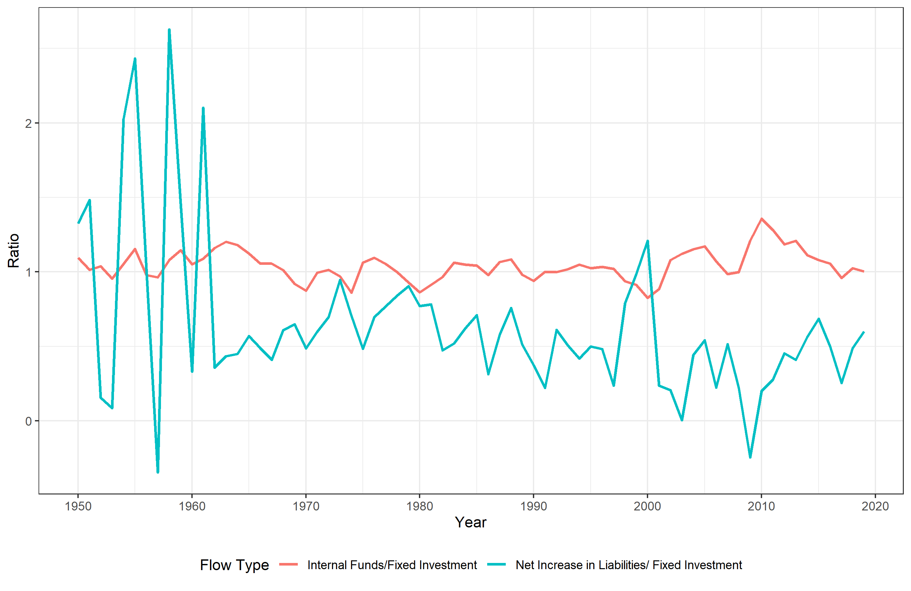
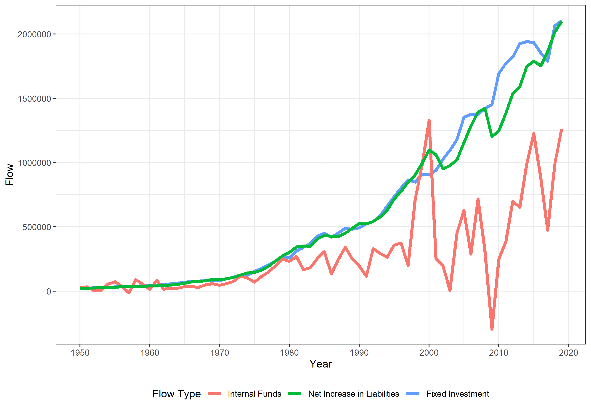

# PART 2

```{r setup, include=FALSE}
knitr::opts_chunk$set(echo = FALSE)
```


```{r,  fig.cap="Relation between fixed Investment, Internal funds and liabilities", out.width = '50%',fig.align = 'center'}

```

```{r,  fig.cap="Relation between fixed Investment, Internal funds and liabilities", out.width = '50%',fig.align = 'center'}

```