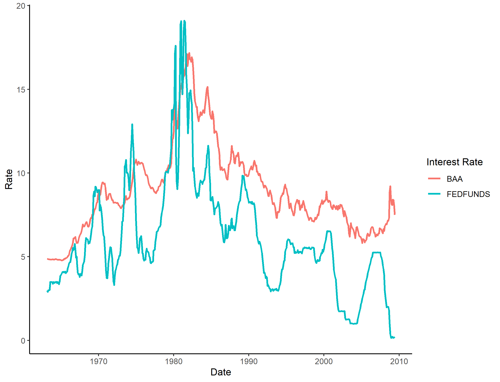
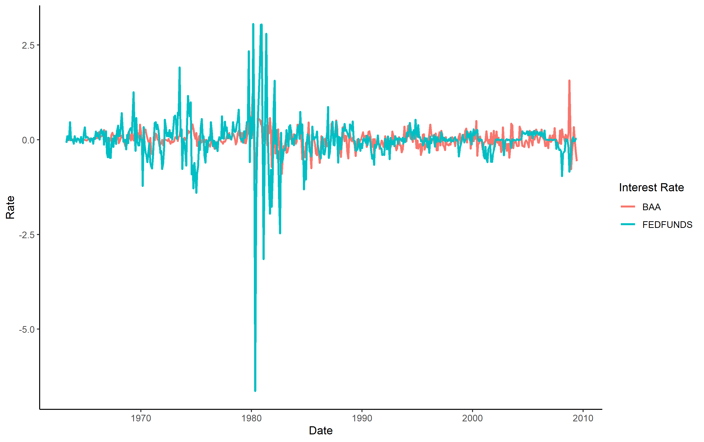

```{r setup, include=FALSE}
knitr::opts_chunk$set(echo = FALSE)
```

# Granger Causality 

```{r}

load("ADF1.Rdata")
load("ADF2.Rdata")
load("granger.table.Rdata")

```

In this exercise we work with time series of the Federal Funds and BAA corporate yield rates to test the  theory that Central Banks, through open market operations, can determine or at least influence to an important degree the market interest rate. We make use of the concept of Granger causality: we test whether the lagged values of time series X help to predict the current value of time-series Y. 

The Granger causality procedure tests the null hypothesis that the coefficients of the lagged values of time series X are jointly equal to zero, so we need both time series to be stationary in order to avoid spurious correlations. A time series is stationary if it has constant mean, variance, and  autocorrelation is the same for values at the same distance in time. We plot the two rates in Figure 1. By visual inspection, we can see that both follow trends: upward until 1982 and downwards after that. This means that the means are not constant and hence our series are very likely to be nonstationary. 


```{r,  fig.cap="BAA and FED Funds rates time series", out.width = '75%',fig.align = 'center'}

```

Formally, a non-stationary time-series can be described by a random-walk process:

$$y_t=y_{t-1}+v_t$$

The Augmented Dickey-Fuller (ADF) test tests whether the coefficient of $y_{t-1}$ is less or equal than one for three different specifications:

Type 1: $y_t=\rho y_{t-1}+v_t$ (No constant and no trend)

Type 2: $y_t=\alpha + \rho y_{t-1}+v_t$ (With constant but no trend)

Type 3: $y_t=\alpha + \rho y_{t-1} +\lambda t+v_t$ (With constant but no trend)


The null hypothesis is $H_0:\rho=1$ and the alternative is $H_1: \rho <1$. Hence, rejecting the null hypothesis is evidence in favor of our time series being stationary. The test is augmented in the sense that it controls for autocorrelarion of the error term by including the number of lags of the time series such that the autocorrelation becomes zero. The results are presented in Table 1. By looking at the p-values, we can see that we fail to reject the null hypothesis at any reasonable level of significance. Hence, we conclude that our time series are non-stationary. 

```{r}
library(knitr)
library(kableExtra)

kbl(ADF1, booktabs=T, digits=3,caption="Augmented Dickey-Fuller Test") %>% add_header_above(c(" ", "Type 1"=2, "Type 2"=2, "Type 3"=2, "Type 1"=2, "Type 2"=2, "Type 3"=2)) %>% 
  add_header_above(c(" ", "BAA"=6, "FEDFUNDS"=6)) %>% kable_styling(position="center", latex_options = "scale_down")

```

In Figure 2 we show the first-differences of our time series($\Delta y_t=y_t-y_{t-1}$) . We can see that all fluctuations occur around 0, although the magnitude of these fluctuations vary between periods: before 1982 and after 1982. The results of the ADF test for the differenced time series are presented in Table 2. 

```{r,  fig.cap="BAA and FED Funds rates time series. (First differences)", out.width = '75%',fig.align = 'center'}

```


```{r}
library(knitr)
library(kableExtra)

kbl(ADF2, booktabs=T, digits=3,caption="Augmented Dickey-Fuller Test: First difference of rates") %>% add_header_above(c(" ", "Type 1"=2, "Type 2"=2, "Type 3"=2, "Type 1"=2, "Type 2"=2, "Type 3"=2)) %>% 
  add_header_above(c(" ", "BAA"=6, "FEDFUNDS"=6)) %>% kable_styling(position="center", latex_options = "scale_down")

```


The null-hypothesis is rejected at the 1% level of significance. So we can conclude that the differenced time series are stationary. Now we conduct the Granger causality tests in both directions: The BAA rate Granger causes the FED Funds Rate and the other way round. For the test we include three different specifications: 2, 5 and 10 lags. The results for the whole period are shown in the first two columns of Table 2. We reject the null hypothesis that the BAA rate does not Granger Cause the FED Funds rate at all levels of statistical signficance. In contrast, we fail to reject the null that the Fed Funds Rate does not Granger cause the BAA rate. Hence, our results go against the theory of the exogeneity of the interest rate: not only the FED funds rate does not precede and predicts the BAA rate, but it actually happens the opposite way. 

For robustness, we perform the same test but for two separate periods: before and after 19882 as, by Figure 1, we can observe that in that year both rates reached their maximum and after that they started to decline. This may be associated to the debt crisis that exploded first in Mexico and then in Latin America after the sharp increase in the interest rates in 1981. The results are presented in columns 3 to 6 of Table 3. For the first period, our basic result that the BAA rate causes the FED Funds rate but not the other way round remains. However, we see that for the specification with 10 lags, the FED Funds rate actually Granger causes the BAA rate. However, when we consider only the (1982-02)-(2009-06) periods, our results show that the BAA rate does not longer Granger causes the FED Funds Rate. Actually, it seems that in this recent period, the FED Funds Rate weakly granger causes the BAA rate in the very short-run, as the only specification which is statistically significant at the 5% level is the one with only two lags.

The conclusion of this analysis is that we do not have statistical evidence in favor of interest rate exogeneity, which is one of the core elements of mainstream macroeconomic theory. 


```{r}
library(knitr)
library(kableExtra)

kbl(granger.table, booktabs=T, digits=3, caption="Granger Causality Tests: BAA and FEDFUNDS") %>% pack_rows(index = c("BAA Rate Granger causes FED Funds Rate"=3, "FED Funds Rate Granger causes BAA Rate"=3)) %>% 
  add_header_above(c("","(1961-03)-(2009-06)"=2, "(1961-03)-(1982-01)"=2, "(1982-02)-(2009-06)"=2)) %>% kable_styling(position="center")

```


# Replication

I presented my advances in the previous problem set. They consist of tables of summary statistics of the main variables: Rules of Origin, Tariffs and Imports at the product level (6 digits according to the Harmonized System). I obtained the data from the online supplemental material of the AEA. In order to exactly replicate their results, I am following step by step their Stata code (I am working in R). However, I have identified some weird steps and one of my extensions would be to work with the Raw data as it is, constructing the variables just as they are defined and then compare my results with those of the original paper. 

\pagebreak

# R code

```{r eval=FALSE, echo=T}

#Econ 753
#PS5
#Jesús Lara

library(dplyr)
library(tidyr)
library(data.table)
library(ggplot2)
library("rio")
library(matlib)
library(gdata)
library(tinytex)
library(car)
library(scales)
library(ggplot2)
library(foreign)
library(rmarkdown)
library(fastDummies)
library(haven)
library(pmdplyr)
library(plotrix)
library(foreign)
library(stringr)
library(alfred)
library(aTSA)
library(lmtest)  ## For Granger causality


options(scipen=10000)
options(digits=4)

rm(list=ls())

setwd("C:/Users/User/Documents/GitHub/Problem-Sets--753/PS5")

### Part 2

BAA  <- get_fred_series("BAA", series_name="BAA")   
FEDFUNDS  <- get_fred_series("FEDFUNDS", series_name="FEDFUNDS") 


ggplot(BAA, aes(x=date,y=BAA))+geom_line()

ggplot(FEDFUNDS, aes(x=date,y=FEDFUNDS))+geom_line()

#1
series<-merge(BAA, FEDFUNDS, by="date")
series<-series %>% filter(date>="1963-03-01" & date<="2009-06-01")

ggplot(series, aes(x=date))+theme_classic() + 
  geom_line(aes(y=BAA,color="black"),size=1)+
  geom_line(aes(y=FEDFUNDS,color="blue"),size=1)+
  xlab("Date")+
  ylab("Rate")+
  scale_color_discrete(name="Interest Rate", label=c("BAA","FEDFUNDS"))

ggsave("BAA.FEDFUNDS.time.series.png")


BAA1<-adf.test(series$BAA)
FEDFUNDS1<-adf.test(series$FEDFUNDS)


## Create a Data Frame with results:

ADF1<-data.frame(BAA1$type1,BAA1$type2[,2:3],
                 BAA1$type3[,2:3],FEDFUNDS1$type1[,2:3], 
                 FEDFUNDS1$type2[,2:3], FEDFUNDS1$type3[,2:3])
colnames(ADF1)<-c("Lag",rep(c("ADF", "P-Value"),6))
save(ADF1, file="ADF1.Rdata")

#The series are non-stationary :(


#2 First difference data


series<-series %>% mutate(d.BAA=c(NA,diff(BAA)),
                          d.FEDFUNDS=c(NA,diff(FEDFUNDS))) #Chulada

#Plot of differents
ggplot(series, aes(x=date), na.rm=TRUE)+theme_classic() + 
  geom_line(aes(y=d.BAA,color="black"),size=1)+
  geom_line(aes(y=d.FEDFUNDS,color="blue"),size=1)+
  xlab("Date")+
  ylab("Rate")+
  scale_color_discrete(name="Interest Rate", 
                       label=c("BAA","FEDFUNDS"))

ggsave("BAA.FEDFUNDS.d.time.series.png")

###
BAA2<-adf.test(series$d.BAA)
FEDFUNDS2<-adf.test(series$d.FEDFUNDS)


## Create a Data Frame with results:

ADF2<-data.frame(BAA2$type1,BAA2$type2[,2:3],
                 BAA2$type3[,2:3],FEDFUNDS2$type1[,2:3], 
                 FEDFUNDS2$type2[,2:3], FEDFUNDS2$type3[,2:3])
colnames(ADF2)<-c("Lag",rep(c("ADF", "P-Value"),6))
save(ADF2, file="ADF2.Rdata")

#### Granger Causality


#Different specifications: number of lags

lags<-c(2, 5, 10)
granger1<-data.frame()
granger2<-data.frame()
granger3<-data.frame()

for (lag in lags){
test1<-grangertest(d.FEDFUNDS ~d.BAA, 
                   order=lag, na.action=na.omit, data=series)
granger1<-rbind(granger1,c(lag, test1[2,3],test1[2,4]))
}

for (lag in lags){
  test1<-grangertest(d.BAA~d.FEDFUNDS, 
                     order=lag, na.action=na.omit, data=series)
  granger1<-rbind(granger1,c(lag, test1[2,3],test1[2,4]))
}

### THREE DIFFERENT CYCLES

#Before 1982

for (lag in lags){
  test1<-grangertest(d.FEDFUNDS ~d.BAA, order=lag,
                     na.action=na.omit, data=filter(series,date<"1982-01-01"))
  granger2<-rbind(granger2,c(test1[2,3],test1[2,4]))
}

for (lag in lags){
  test1<-grangertest(d.BAA~d.FEDFUNDS, order=lag,
                     na.action=na.omit, data=filter(series,date<"1982-01-01"))
  granger2<-rbind(granger2,c(test1[2,3],test1[2,4]))
}


#After 1882

for (lag in lags){
  test1<-grangertest(d.FEDFUNDS ~d.BAA, order=lag,
                     na.action=na.omit, data=filter(series,date>="1982-01-01"))
  granger3<-rbind(granger3,c(test1[2,3],test1[2,4]))
}

for (lag in lags){
  test1<-grangertest(d.BAA~d.FEDFUNDS, order=lag, 
                     na.action=na.omit, data=filter(series,date>="1982-01-01"))
  granger3<-rbind(granger3,c(test1[2,3],test1[2,4]))
}

#Everything together

granger.table<-cbind(granger1,granger2,granger3)
colnames(granger.table)<-c("Lags", rep(c("F", "P-Value"),3))

save(granger.table,file="granger.table.Rdata")

```
